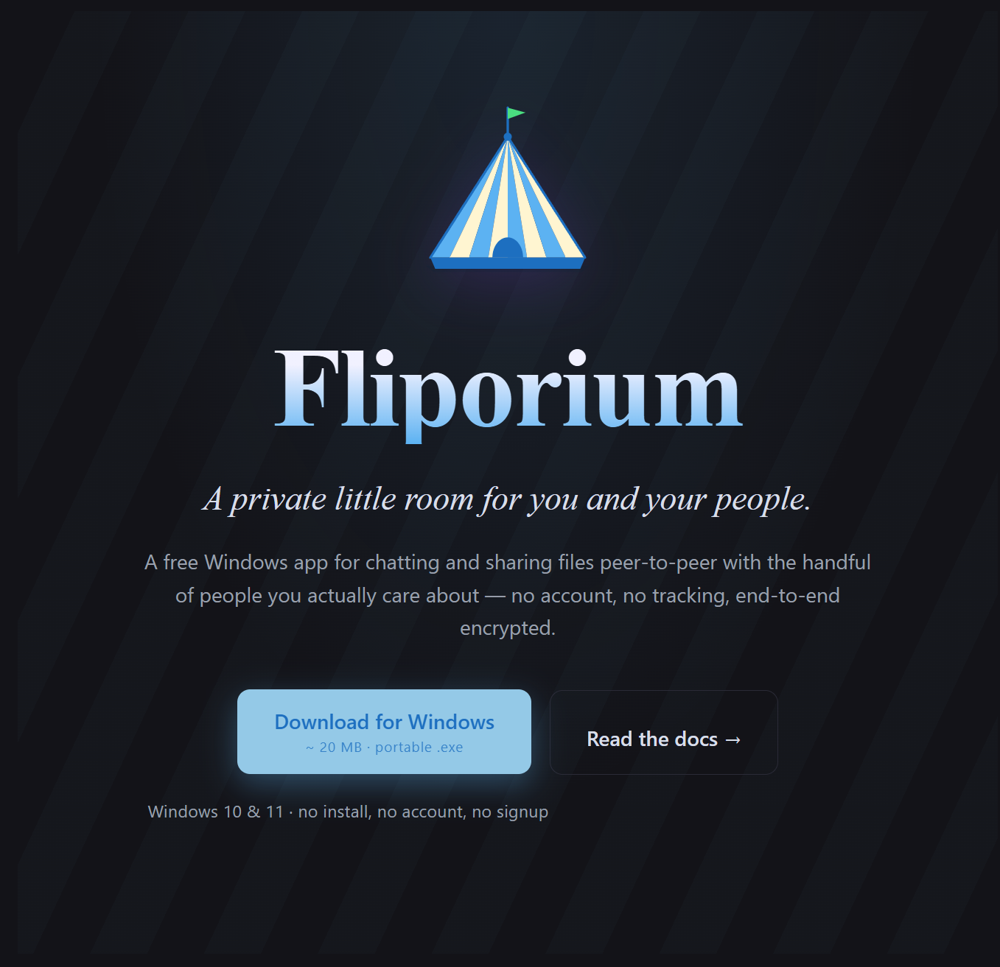

<p align="center">
  
</p>

<h1 align="center">Fliporium</h1>

<p align="center">
  <strong>Private peer-to-peer chat &amp; file sharing for Windows</strong> — end-to-end encrypted,<br>
  no account, no servers in the middle. Just you and your people.
</p>

<p align="center">
  <a href="https://fliporium.com/dl/fliporium.exe"><strong>⬇&nbsp;Download for Windows</strong></a> ·
  <a href="https://fliporium.com">Website</a> ·
  <a href="https://fliporium.com/docs">Docs</a> ·
  <a href="https://fliporium.com/privacy">Privacy</a>
</p>

<p align="center">
  
  
  
</p>

---

[Fliporium](https://fliporium.com) is a portable Windows desktop app for chatting and
sharing files with a small, private group — peer-to-peer over WebRTC, end-to-end
encrypted, with no account and no central content server.

You download one `.exe`, create a room, and share its invite link. Whoever has
the link connects directly to you over a WebRTC mesh, and messages and files
flow device-to-device. A small coordination server introduces peers and relays
the encrypted handshake; it never sees message content.

## How it works

- **Transport** — [pion/webrtc](https://github.com/pion/webrtc) DataChannels in
  a full mesh (capped at 16 peers per room). Every feature — chat, file
  transfer, reactions, presence — rides the same length-prefixed JSON envelope
  protocol over the channel.
- **Coordination** — a small Go signaling server (`flipsignal`) over WebSocket
  handles matchmaking, relays the WebRTC SDP/ICE handshake, holds an encrypted
  offline backlog, and mints short-lived TURN credentials. It never sees
  plaintext.
- **NAT traversal** — STUN for hole-punching, with a coturn TURN relay as an
  encrypted fallback for restrictive networks.
- **Identity** — an Ed25519 keypair generated on first launch. The routing id is
  the key's fingerprint (`fp-…`); a signed challenge during the handshake proves
  key ownership, which is what prevents impersonation. No signup.
- **Encryption** — each room has a 32-byte NaCl secretbox key carried in the
  invite link's URL fragment (after `#`), which browsers never send to a server.
  Message bodies and offline-backlog blobs are sealed with it, so the signaling
  and TURN servers only ever handle ciphertext.
- **Storage** — local SQLite (`modernc.org/sqlite`, pure Go, no cgo) with FTS5
  full-text search. Identity, history, and caught files all live in the data dir
  next to the `.exe`.
- **UI** — [Wails v2](https://wails.io) (WebView2) with a plain HTML/CSS/JS
  frontend embedded via `//go:embed` — no JavaScript build chain.

## Features

- **Rooms** — invite-link group spaces, 1:1 chat, and private DMs handed
  peer-to-peer over the encrypted link.
- **Messages** — Markdown, replies, emoji reactions, edit, delete-for-everyone,
  pin, and link/YouTube preview cards (unfurled by the sender only, so
  recipients never contact the link).
- **File "flips"** — drag-and-drop or file picker, fan-out to a whole room,
  paste images; inline previews for images, video, audio, PDF, and text/code.
- **Offline delivery** — messages sent while a peer is away wait (encrypted) on
  the server and arrive when they reconnect.
- **Search** — full-text across all local history.
- **Presence** — active / idle / away.
- **Twin Mode** — pair two of your own devices so 1:1 history stays in sync.
- **Backstage** — display name and avatar, dark/light theme, notification chime,
  a per-identity block list, and a "burn everything" local wipe.

## Layout

```
cmd/
  fliporium/       Wails desktop app (the product); embeds frontend/dist
    main.go        entry point + WebView2 asset/catch server
    app.go         App struct + methods bound to JS
    avatar.go      profile-image pick/downscale
    unfurl.go      sender-side link unfurling (+ SSRF / decode-bomb guards)
    frontend/dist  index.html / main.js / style.css (no build step)
  flipsignal/      signaling + matchmaking server (WebSocket)
  flipstats/       public stats + .exe download counter + contact relay (VPS)
  probestore/      dev tool: dump a store.db
  setpref/         dev tool: read/write the app_settings table
internal/
  peer/            protocol (proto.go), Hub + dispatch (peer.go), WebRTC glue
                   (webrtc.go), file transfer (flip.go), E2E crypto (crypto.go)
  rtc/             signaling client/server (signal.go, server.go), room mesh
                   (room.go), single-peer Connect (rtc.go)
  identity/        Ed25519 install identity
  store/           SQLite persistence + FTS5 search
deploy/            Caddyfile, systemd units, install/deploy scripts (see deploy/README.md)
site/              the marketing site served at fliporium.com
build.ps1          build the GUI and/or signaling server
run.ps1            launch the GUI (builds first if needed)
```

## Build

Requires Go 1.26+ on `PATH` (or the user-scope install at `~/go-sdk/bin`).

```powershell
.\build.ps1            # GUI + signaling server
.\build.ps1 -Gui       # GUI only
.\build.ps1 -Signal    # signaling server only
```

**The GUI must be built with the Wails build tags.** `build.ps1` does this; if
you ever call `go build` by hand:

```powershell
go build -tags 'desktop,production' -ldflags '-H windowsgui -s -w' -o fliporium.exe ./cmd/fliporium
```

Without the tags the binary launches and immediately pops a Win32 error dialog.

## Run

```powershell
.\run.ps1                   # data dir: fliporium-data, next to the exe
.\run.ps1 -Name alice       # data dir fliporium-data-alice (a second local instance)
.\run.ps1 -DataDir D:\flip  # explicit data/identity folder
```

Each data dir is an independent install with its own Ed25519 identity, generated
on first launch. There's no auth key and no signup — create a room or paste an
invite link from inside the app.

### Environment

| Variable | Effect |
| --- | --- |
| `FLIPORIUM_DIR` | data/identity directory (default: `fliporium-data` next to the exe) |
| `FLIPORIUM_HOSTNAME` | override the routing id (normally the Ed25519 fingerprint; used to run several peers on one box) |
| `FLIPORIUM_SIGNAL` | signaling server URL (default `wss://fliporium.com/ws`) |
| `FLIPORIUM_STUN` | comma-separated STUN servers |
| `FLIPORIUM_ROOM` | auto-join a room id at launch (dev/testing) |

## Security & privacy

- Peers are authenticated by a **signed Ed25519 challenge** bound to both sides'
  nonces, so a peer can't claim another's identity or relay a third party's proof.
- Room content is **end-to-end encrypted** with a per-room NaCl secretbox key
  that lives only in the invite link. The signaling and TURN servers handle
  ciphertext only.
- The server can see connection **metadata** (room ids, a chosen display name,
  who is online) but never message or file content. With no accounts, none of it
  ties to a real identity.

See the [privacy page](https://fliporium.com/privacy) for the user-facing version.

## Dev tools

```powershell
go run ./cmd/probestore <data-dir>            # dump a store.db's peers and messages
go run ./cmd/setpref <data-dir> <key> [value] # read (no value), set, or delete (empty value) a setting
```

## Tests

```powershell
go test ./...
```

Coverage includes the protocol and handshake (impersonation and auth-relay
resistance), offline-backlog authentication, end-to-end encryption round-trips,
the SQLite store, and the link-unfurl guards.

## Run your own

Fliporium has no lock-in — anyone can run the coordination piece. Stand up
`flipsignal` (a single Go binary) on any host, optionally add a coturn relay for
hard NATs, and point clients at it with `FLIPORIUM_SIGNAL=wss://your-host/ws`.
The [`deploy/`](deploy/README.md) folder has a Caddyfile, systemd units, and an
install script: copy [`.vps.example`](.vps.example) to `.vps`, fill in your
server, and run `./deploy/deploy.sh`. Your messages stay end-to-end encrypted no
matter whose server brokers the handshake.

The reference deployment (signaling server, the `flipstats` download/stats/contact
service, coturn, and Caddy) runs the official build at
[fliporium.com](https://fliporium.com).

## Contributing

Issues and PRs welcome. Keep `go test ./...` green, and remember the GUI must be
built with the Wails tags (see [Build](#build)). Official Windows builds come
only from [fliporium.com](https://fliporium.com) — please don't distribute
look-alike binaries under the Fliporium name.

## License

[MIT](LICENSE). Windows 10/11 today; the networking core is cross-platform, so
other desktop targets are possible later.
